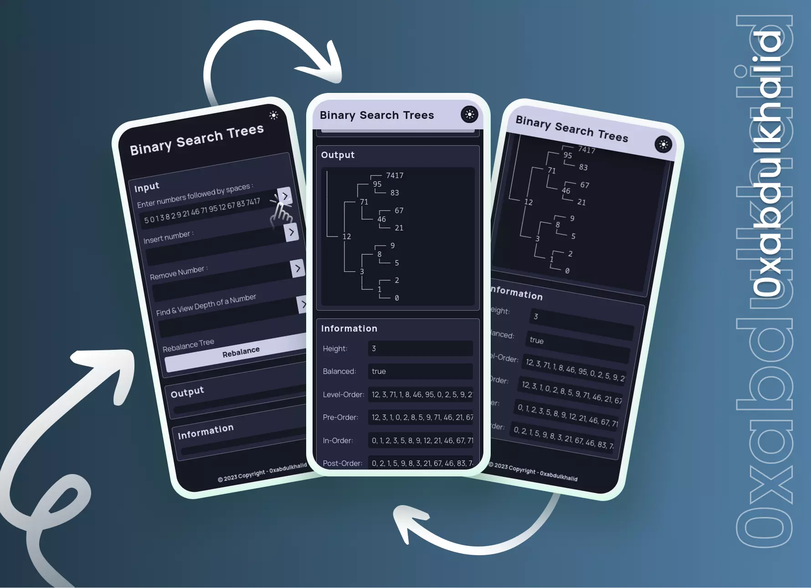

<br>

<div align="center">

<br>
<br>

**❝** Experience binary search trees in action with interactive demonstrations **❞**

<br>
  <p>
    ❯ &nbsp;
    <a href="https://binary-search-trees.vercel.app/">View Demo</a>
    &nbsp;·&nbsp;
    <a href="https://github.com/0xabdulkhaliq/binary-search-trees/issues">Report Bug</a>
    &nbsp;·&nbsp;
    <a href="https://github.com/0xabdulkhaliq/binary-search-trees/issues">Request Feature</a>
     &nbsp; ❮
  </p>
</div>

<br>

<div align='center'>

</div>

<br>

## Installation

> [!NOTE]  
> If you prefer not to install it locally, you can also access the [live demo](https://binary-search-trees.vercel.app/)  version


To set up the BST Application locally, follow these steps:

1. Clone the GitHub repository to your local machine:

   ```bash
   git clone https://github.com/0xabdulkhaliq/binary-search-trees.git
   ```

2. Navigate to the project's directory:

   ```bash
   cd binary-search-trees
   ```

3. Install the project's dependencies using npm:

   ```bash
   npm install
   ```

4. Build the project to bundle JavaScript, minify HTML and CSS, and move images:

   ```bash
   npm run build
   ```
5. The build files can be found on `dist` (distribution) directory.

<br>


## Features

- **Create and Visualize BST**: Easily create a binary search tree from an array and visualize its structure.

- **Interactive Operations**: Insert, delete, and search for values within the tree, providing insights into how BSTs work.

- **Measure Tree Height**: Calculate the height of the tree, an essential metric in tree analysis.

- **Determine Depth**: Find the depth of a specific value in the tree to understand its position.

- **Check for Balance**: Evaluate tree balance to optimize performance.

- **Tree Traversals**: Explore different tree traversal algorithms, including level-order, pre-order, in-order, and post-order.

- **Seamless Theme Switching**: Enjoy a light or dark theme at your convenience, and your preferred theme is automatically saved in local storage for a consistent experience across visits.

- **Optimized for Any Screen**: Effortlessly adapt to screens of all sizes, ensuring a flawless experience on both desktop and mobile devices.

- **ES6 Modules**: JavaScript code is organized into ES6 modules for improved maintainability.

- **Webpack Bundling**: Optimize resource loading by bundling JavaScript modules with Webpack.

- **Cross-Browser Compatibility**: Ensure smooth performance across various web browsers.

- **Code Formatting Guidelines**: The project adheres to coding standards and maintains code consistency by implementing ESLint along with Prettier for code formatting.

<br>

## Pagespeed Insights Score
  
- ||
  | :-----: |
  |  <b>Overall Score 98.5%, Average of Mobile and Desktop</b><br>[ Mobile devices score is only shown below ] |
  | |
  |  |
  | |
  | Check out [**Pagespeed Insights**](https://pagespeed.web.dev/analysis?url=https%3A%2F%2Fbinary-search-trees.vercel.app%2F) to get live score |
  ||

<br>

## Built With

<div align=center>

  &nbsp;&nbsp; &nbsp;&nbsp; &nbsp;&nbsp; &nbsp;&nbsp; &nbsp;&nbsp;

</div>

<br>

## Tools Used

<div align=center>
  
 &nbsp;&nbsp; &nbsp;&nbsp; &nbsp;&nbsp; &nbsp;&nbsp; &nbsp;&nbsp; &nbsp;&nbsp;

</div>

<br>

## Let's Connect 👋

<div align=center>

  <a href="https://linkedin.com/in/0xabdulkhaliq" >
    
  </a>&nbsp;&nbsp;

  <a href="mailto:0xabdulkhaliq@gmail.com" target="_blank">
    
  </a>&nbsp;&nbsp;

  <a href="https://www.github.com/0xabdulkhaliq/" >
    
  </a>

</div>

<br>
